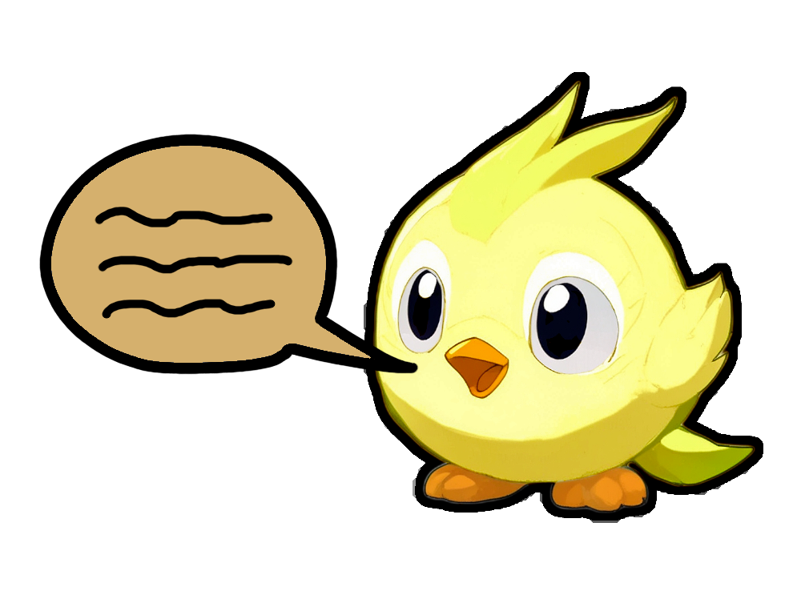

# Chatofus

Chatofus est une application qui connecte le chat in-game de Dofus 3 à un serveur distant, offrant aux joueurs un accès permanent aux informations importantes du jeu. L'application enrichit l'expérience de chat standard avec des fonctionnalités avancées de gestion et de suivi.

## ✨ Fonctionnalités

- **Suivi du Chat à Distance** : Restez connecté au chat du jeu même lorsque vous n'êtes pas devant votre PC
- **Système de Tags** : Organisez et filtrez les messages selon vos besoins
- **Notifications Personnalisables** : Ne manquez aucune information importante
- **Récapitulatifs Intelligents** :
  - Timer des Avis de Recherche
  - Positions des Portails

---

> **Note** : Ce projet est une initiative personnelle non-officielle et n'est pas affilié à Ankama Games.
